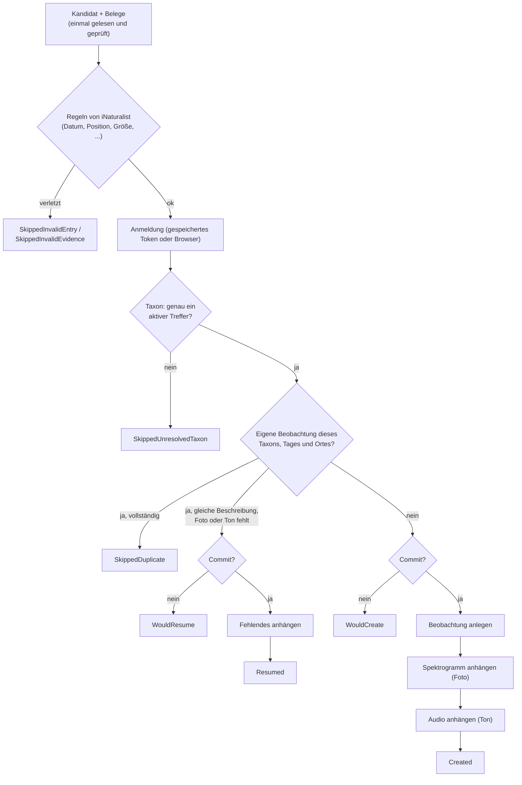

# iNaturalist: was wohin gelangt

English version: [inaturalist.md](inaturalist.md)

Diese Seite beschreibt, was `INaturalistPublisher` mit einem Eintrag der Eingabedatei macht: welches Feld zu welchem
iNaturalist-Feld wird, die Schritte eines Laufs, die Ergebnisse und was danach öffentlich ist. Registrierung, Anmeldung und
Ratenbegrenzung stehen in [inaturalist-setup.de.md](inaturalist-setup.de.md); wie die Eingabedatei gelesen wird, steht in
[input-format.de.md](input-format.de.md).

Alles hier ist aus dem Code sowie aus dem Open-Source-Code und dem Forum von iNaturalist abgeleitet. Verhalten, das nur ein
Live-Lauf zeigen kann, ist noch nicht überprüft und als solches gekennzeichnet.

## Die Schritte eines Kandidaten

Vor dem ersten Schritt hat der Orchestrator beide Belegdateien gelesen und geprüft (siehe
[input-format.de.md](input-format.de.md#belegdateien)); eine fehlende Datei ist `SkippedMissingEvidence`. Ein **Probelauf**
(Standard, `PublishOptions.Commit = false`) durchläuft jeden Schritt einschließlich Anmeldung, Taxonsuche und
Duplikatprüfung und hält an, wo der erste Schreibzugriff käme. Im Probelauf wird nichts angelegt.

Die Schritte verwenden diese Endpunkte von iNaturalist:

| Schritt | Anfrage |
|---|---|
| Taxon | `GET /v2/taxa/autocomplete` |
| Duplikatprüfung, Fortsetzen | `GET /v1/observations` (`mine_only=true`) |
| Anlegen | `POST /v2/observations` |
| Spektrogramm | `POST /v2/observation_photos` (eine Multipart-Anfrage, die hochlädt und verknüpft) |
| Audio | `POST /v2/observation_sounds` (ebenso) |

## Vom Eingabefeld zum iNaturalist-Feld

| Eingabe | iNaturalist | Hinweise |
|---|---|---|
| `SpeciesLatin` | `taxon_id` | Live aufgelöst, siehe [Art und Taxon](#art-und-taxon). |
| `SpeciesLatin` | `species_guess` | Der Name aus der Datei, normalisiert. Bei einem unsicheren Ruf wie `Nyctaloid` bleibt hier der ursprüngliche Wert, während `taxon_id` das weitere Taxon ist. |
| `Date` | `observed_on_string` | Nur der lokale Kalendertag als `yyyy-MM-dd`. Die Uhrzeit wird **noch nicht** gesendet (sie würde in der Zeitzone des Kontos gelesen). Die volle Zeit steht in der Beschreibung. |
| `Latitude`, `Longitude` | `latitude`, `longitude` | Unverändert. Eine Positionsgenauigkeit wird nicht gesendet. |
| `Latitude`, `Longitude` | `place_guess` | Die Koordinaten als Text mit fünf Nachkommastellen (`50.11000, 8.68200`): Die Eingabe hat keinen Ortsnamen, und v2 lehnt einen leeren Wert ab. |
| `Temperature`, `Humidity`, `Comment`, `Date`, `TimeZone` | `description` | Deutscher Text, siehe unten. |
| `PathToPng` | Foto | Das Spektrogramm, hochgeladen unter seinem Dateinamen. |
| `PathToWav` | Ton | Die Aufnahme, hochgeladen unter ihrem Dateinamen. |
| `SpeciesLocal` | nicht gesendet | |
| (Optionen) | `tag_list` | `INaturalistOptions.TagList`, Standard `bat,acoustic-monitoring,batinspector`. |

Nicht gesendet werden: die Uhrzeit, eine Positionsgenauigkeit, Geoprivacy, Captive/Cultivated-Kennzeichen. Das Paket behandelt
sensible Arten nicht; iNaturalist verschleiert die Koordinaten von Taxa, die es für sensibel hält, selbst.

### Die Beschreibung

Die Beschreibung ist mit Absicht deutsch (alle Nutzer des Pakets sind deutschsprachig, und sie ist öffentlicher Inhalt auf der
Plattform). Sie besteht aus diesen Teilen, jeweils nur, wenn die Daten da sind:

1. `INaturalistOptions.DescriptionPrefix` (Standard: *Automatisierte passive akustische Erfassung (BatInspector, batdetect2 + manuelle Prüfung).*)
2. Die Aufnahmezeit mit Zone: `Exemplarische Ruferkennung vom 13.06.2026 04:26:34 Uhr MESZ.` Europe/Berlin heißt `MEZ` oder
   `MESZ`; jede andere Zone wird ausdrücklich genannt (`(Zeitzone Europe/Lisbon, UTC+01:00)`), nie aus dem Offset erraten.
3. Bei einem unsicheren Ruf, der unter einem weiteren Taxon abgelegt wird: `Bestimmung in BatInspector: "Nyctaloid" (keine sichere Artbestimmung), hier als Chiroptera eingetragen.`
4. `Temperatur: 20,5 °C.` und `Luftfeuchte: 92,4 %.` (höchstens eine Nachkommastelle, deutsches Dezimalkomma)
5. `Anmerkung zur Bestimmung: <Comment>`
6. `Beleg: Spektrogramm und Audioaufnahme dieser Ruferkennung.`

Für den Eintrag im [Beispiel](input-format.de.md#beispiel) lautet die Beschreibung:

> Automatisierte passive akustische Erfassung (BatInspector, batdetect2 + manuelle Prüfung). Exemplarische Ruferkennung vom 13.06.2026 04:26:34 Uhr MESZ. Temperatur: 20,5 °C. Luftfeuchte: 92,4 %. Beleg: Spektrogramm und Audioaufnahme dieser Ruferkennung.

`PublishResult.Description` enthält den Text, auch im Probelauf, damit der Host zeigen kann, was öffentlich würde. Die
Beschreibung erkennt außerdem eine Beobachtung als eine, die dieses Paket für den Eintrag angelegt hat (siehe
[Erneuter Lauf](#erneuter-lauf-duplikate-und-fortsetzen)).

## Art und Taxon

Taxa werden **für jeden Kandidaten live** mit `taxa/autocomplete` aufgelöst und nie zwischengespeichert oder als Liste
mitgeliefert. Ein Name wird nur akzeptiert, wenn genau ein aktives Taxon genau diesen Namen und den erwarteten Rang hat
(zwei Wörter: Art; ein Wort: Gattung). Es wird nichts geraten: kein „erster Treffer der Autovervollständigung“, kein
weiteres Taxon für einen Tippfehler.

| Situation | Ergebnis |
|---|---|
| Ein aktives Taxon, Name und Rang passen | Wird verwendet. |
| Mehrere Treffer | `SkippedUnresolvedTaxon`, mehrdeutig (die Ids stehen in der Meldung). |
| Der Name existiert, aber nur mit anderem Rang | `SkippedUnresolvedTaxon`, falscher Rang. |
| Der Name ist ein Synonym | `SkippedUnresolvedTaxon`, mit dem aktuellen Namen. Die Eingabedatei korrigieren. |
| Nicht gefunden | `SkippedUnresolvedTaxon`, nicht gefunden. |
| Drei oder mehr Wörter | `SkippedUnresolvedTaxon` ohne Anfrage. |

Die Gruppen- und Unsicherheitswerte von BatInspector sind die einzige Ausnahme, eine kleine feste Tabelle, die immer gilt und
keine Option hat:

| `SpeciesLatin` | Abgelegt unter | `species_guess` |
|---|---|---|
| `Nyctaloid`, `Social`, `?` | Chiroptera (Ordnung) | der ursprüngliche Wert |
| `Mbart` | *Myotis* (Gattung) | `Mbart` |

`PublishResult.TaxonName` nennt das Taxon, unter dem eine Beobachtung abgelegt ist (oder im Probelauf würde). Der Nutzer kann
die Bestimmung auf iNaturalist verfeinern. `todo` und jeder andere Wert, der kein Taxonname ist, wird übersprungen.

## Erneuter Lauf: Duplikate und Fortsetzen

Bevor etwas angelegt wird, fragt der Publisher iNaturalist nach **deinen eigenen** Beobachtungen (`mine_only=true`) des
aufgelösten Taxons am selben Kalendertag im Umkreis von `INaturalistOptions.DuplicateCheckRadiusKm` (Standard 0,1 km = 100 m).

- **Nichts gefunden:** Die Beobachtung wird angelegt.
- **Etwas gefunden, und es ist vollständig oder nicht als die dieses Eintrags erkennbar:** `SkippedDuplicate`. Die vorhandene
  Beobachtung steht in `ObservationId`, wenn sie bekannt ist. Sie wird nie angefasst.
- **Etwas gefunden, mit einer Beschreibung, die (bis auf Leerraum) der entspricht, die dieser Eintrag erzeugt, und es fehlt
  Foto oder Ton:** Ein früherer Lauf hat sie angelegt und ist vor dem vollständigen Beleg stehengeblieben. Der fehlende Beleg
  wird angehängt (`Resumed`, im Probelauf `WouldResume`). Es wird nur eine Beobachtung fortgesetzt, die eindeutig von diesem Paket stammt.

Sagt das Suchergebnis nicht, ob Fotos und Töne vorhanden sind, bleibt die Beobachtung mit Absicht unberührt
(`SkippedDuplicate`): Eine falsche Annahme geht so sicher aus.

Was man über diese Prüfung wissen sollte:

- Sie verlässt sich darauf, dass die Datei eine Referenzaufnahme pro Art, Nacht und Ort enthält. Mehrere Einträge für eine
  Kombination werden nach dem ersten übersprungen; der Probelauf kann das nicht vorhersehen, weil er nichts anlegt, und
  meldet für alle `WouldCreate`.
- Der Filter `taxon_id` von iNaturalist soll die untergeordneten Taxa einschließen. Ein Eintrag für eine Art wird dann mit
  deinen Beobachtungen dieser Art (und ihrer Unterarten) verglichen, ein Eintrag unter einem weiteren Taxon (`Nyctaloid` unter
  Chiroptera, `Mbart` unter *Myotis*) kann dagegen zu jeder deiner Beobachtungen unterhalb dieses Taxons an diesem Tag und Ort
  passen und als Duplikat übersprungen werden. Noch nicht live überprüft.
- Beobachtungen, die nach der Prüfung bei iNaturalist auftauchen oder verschwinden, werden nicht vorhergesehen.

## Ergebnisse

`PublishResult.Status` bei iNaturalist (der Grund steht immer in `Message`):

| Status | Bedeutung |
|---|---|
| `Created` | Beobachtung angelegt, Spektrogramm und Audio angehängt. `ObservationId` und `Url` sind gesetzt. |
| `WouldCreate` | Probelauf: Ein echter Lauf würde sie anlegen. |
| `WouldResume` | Probelauf: Ein echter Lauf würde einer unvollständigen Beobachtung eines früheren Laufs das Fehlende anhängen. |
| `Resumed` | Eine unvollständige Beobachtung eines früheren Laufs wurde vervollständigt. Keine neue Beobachtung. |
| `SkippedDuplicate` | Eine gleichwertige Beobachtung von dir existiert bereits. |
| `SkippedUnresolvedTaxon` | Der Name wurde nicht zu genau einem Taxon aufgelöst, siehe [Art und Taxon](#art-und-taxon). |
| `SkippedInvalidEntry` | Der Eintrag verletzt eine Regel von iNaturalist (unten) oder eine plattformneutrale Regel. Es wurde nichts geschrieben. |
| `SkippedInvalidEvidence` | Eine Datei ist nicht lesbar, leer, kein PNG / WAV oder größer als `MaxEvidenceBytes`. Es wurde nichts geschrieben. |
| `SkippedMissingEvidence` | Eine Datei existiert nicht. Es wurde nichts geschrieben. |
| `Failed` | Ein Fehler. Kann teilweise sein: `ObservationId` ist gesetzt, wenn die Beobachtung existiert, `SpectrogramAttached` und `AudioAttached` sagen, was vorhanden ist, `InterruptedStep` nennt die Stufe. |
| `Cancelled` | Der Aufrufer hat abgebrochen. Dieselben Teilinformationen wie bei `Failed`. |

Ein `Failed`- oder `Cancelled`-Ergebnis braucht kein Aufräumen: Der Lauf wird wiederholt, und Duplikatprüfung und Fortsetzen
vervollständigen es. Kam der Abbruch, während die Beobachtung angelegt wurde, ist unbekannt, ob sie existiert; der nächste Lauf
findet es heraus.

### Vor dem Schreiben geprüfte Regeln

Die eigene Prüfung des Adapters läuft vor der Anmeldung, auch im Probelauf, und nennt alle Probleme in einer Meldung. Sie
weist ab, was iNaturalist ablehnen würde; sonst scheiterte ein abgelehnter Upload erst, nachdem die Beobachtung angelegt
wurde, und hinterließe eine öffentliche Beobachtung ohne Foto oder Ton.

| Regel | Grenze |
|---|---|
| Dateigröße, Spektrogramm und Audio je | 20 MB (`INaturalistOptions.MaxEvidenceBytes`, Standard 20.000.000 Byte) |
| Beobachtungsdatum | nicht nach morgen (UTC), nicht älter als 130 Jahre |
| Breitengrad | größer als -90 und kleiner als 90 |
| Längengrad | -180 bis 180 |
| Position | nicht genau 0, 0 |
| `species_guess` | höchstens 255 Zeichen |
| `INaturalistOptions.TagList` | höchstens 750 Zeichen insgesamt, höchstens 255 pro Tag |

Einzelheiten, Quellen und die offenen Fragen (die Regeln stammen aus dem Open-Source-Code und dem Forum von iNaturalist und
sind nicht live überprüft) stehen in
[inaturalist-setup.de.md](inaturalist-setup.de.md#grenzen-und-regeln-die-vor-dem-veröffentlichen-geprüft-werden). Fehlertexte von
iNaturalist selbst werden unverändert in `Message` durchgereicht.

## Was öffentlich und nicht rückgängig zu machen ist

Ein echter Lauf veröffentlicht auf dem Konto des angemeldeten Nutzers:

- die Beobachtung mit ihren **genauen Koordinaten** (sofern iNaturalist ein sensibles Taxon nicht verschleiert), Datum, Taxon,
  Tags und der Beschreibung, die die Messwerte und die Anmerkung enthält;
- das Spektrogramm als Foto und die Aufnahme als Ton, unter ihren Dateinamen.

Das Paket löscht oder ändert nie eine Beobachtung. Es löscht auch keine, deren Beleg nicht angehängt werden konnte (der
Fehler kann vorübergehend sein, und das Fortsetzen vervollständigt sie). Änderungen und Löschungen erfolgen bei iNaturalist.

Deshalb ist ein Lauf ein Probelauf, solange nicht `Commit = true` übergeben wird. Vor einem echten Lauf sollten
`RunReport.Rejected`, `RunReport.Warnings` und die Ergebnisse des Probelaufs (einschließlich `Description`) dem Nutzer angezeigt werden.
