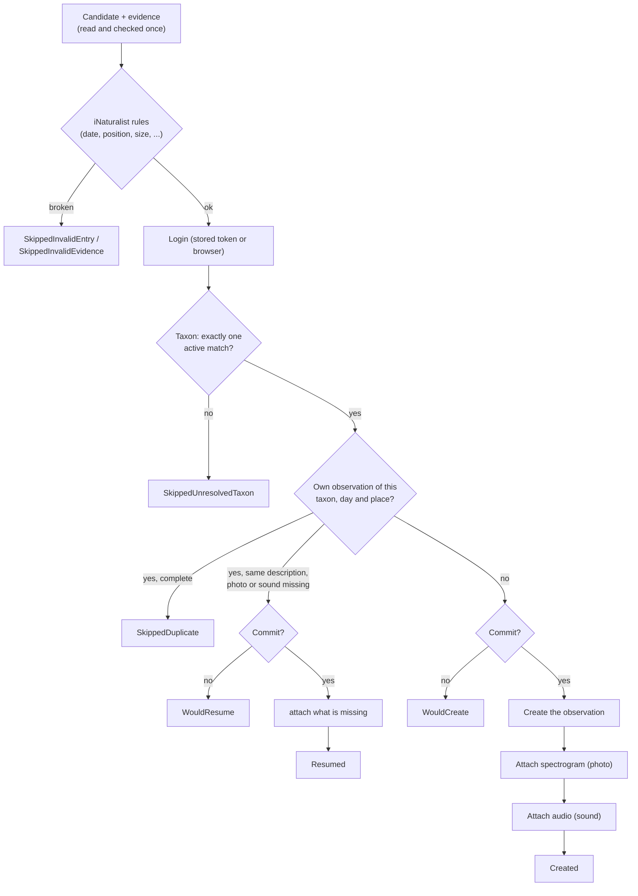

# iNaturalist: what lands where

German version: [inaturalist.de.md](inaturalist.de.md)

This page describes what `INaturalistPublisher` does with an entry of the input file: which field becomes which iNaturalist
field, the steps of one run, the outcomes and what is public afterwards. Registration, login and the rate limits are in
[inaturalist-setup.md](inaturalist-setup.md); how the input file is read is in [input-format.md](input-format.md).

Everything here is derived from the code and from iNaturalist's open source and forum. The behavior that only a live run can
show is not verified yet and is marked as such.

## The steps of one candidate

Before the first step the orchestrator has read both evidence files and checked them (see
[input-format.md](input-format.md#evidence-files)); a missing file is `SkippedMissingEvidence`. A **dry run** (the default,
`PublishOptions.Commit = false`) goes through every step including the login, the taxon search and the duplicate check, and
stops where the first write would happen. Nothing is created in a dry run.

The steps use these iNaturalist endpoints:

| Step | Request |
|---|---|
| Taxon | `GET /v2/taxa/autocomplete` |
| Duplicate check, resume | `GET /v1/observations` (`mine_only=true`) |
| Create | `POST /v2/observations` |
| Spectrogram | `POST /v2/observation_photos` (one multipart request that uploads and links) |
| Audio | `POST /v2/observation_sounds` (the same way) |

## From input field to iNaturalist field

| Input | iNaturalist | Notes |
|---|---|---|
| `SpeciesLatin` | `taxon_id` | Resolved live, see [Species and taxon](#species-and-taxon). |
| `SpeciesLatin` | `species_guess` | The name from the file, normalized. For an uncertain call such as `Nyctaloid` this keeps the original value while `taxon_id` is the broader taxon. |
| `Date` | `observed_on_string` | The local calendar day only, as `yyyy-MM-dd`. The time is **not** sent yet (it would be read in the account's own time zone). The full time is in the description. |
| `Latitude`, `Longitude` | `latitude`, `longitude` | As they are. No positional accuracy is sent. |
| `Latitude`, `Longitude` | `place_guess` | The coordinates as text with five decimals (`50.11000, 8.68200`): the input has no place name and v2 rejects an empty value. |
| `Temperature`, `Humidity`, `Comment`, `Date`, `TimeZone` | `description` | German text, see below. |
| `PathToPng` | photo | The spectrogram, uploaded under its file name. |
| `PathToWav` | sound | The recording, uploaded under its file name. |
| `SpeciesLocal` | not sent | |
| (options) | `tag_list` | `INaturalistOptions.TagList`, default `bat,acoustic-monitoring,batinspector`. |

Not sent: the time of day, a positional accuracy, geoprivacy, captive/cultivated flags. The package does not handle
sensitive species; iNaturalist obscures the coordinates of taxa it considers sensitive by itself.

### The description

The description is German on purpose (all users of the package are German speaking, and it is public content on the
platform). It is built from these parts, each only when its data is there:

1. `INaturalistOptions.DescriptionPrefix` (default: *Automatisierte passive akustische Erfassung (BatInspector, batdetect2 + manuelle Prüfung).*)
2. The recording time with the zone: `Exemplarische Ruferkennung vom 13.06.2026 04:26:34 Uhr MESZ.` Europe/Berlin is named
   `MEZ` or `MESZ`; any other zone is named explicitly (`(Zeitzone Europe/Lisbon, UTC+01:00)`), never guessed from the offset.
3. For an uncertain call filed under a broader taxon: `Bestimmung in BatInspector: "Nyctaloid" (keine sichere Artbestimmung), hier als Chiroptera eingetragen.`
4. `Temperatur: 20,5 °C.` and `Luftfeuchte: 92,4 %.` (one decimal at most, German decimal comma)
5. `Anmerkung zur Bestimmung: <Comment>`
6. `Beleg: Spektrogramm und Audioaufnahme dieser Ruferkennung.`

For the entry in the [example](input-format.md#example) the description reads:

> Automatisierte passive akustische Erfassung (BatInspector, batdetect2 + manuelle Prüfung). Exemplarische Ruferkennung vom 13.06.2026 04:26:34 Uhr MESZ. Temperatur: 20,5 °C. Luftfeuchte: 92,4 %. Beleg: Spektrogramm und Audioaufnahme dieser Ruferkennung.

`PublishResult.Description` carries the text, also in a dry run, so the host can show what would become public. The
description also identifies an observation as one this package created for the entry (see [Re-running](#re-running-duplicates-and-resume)).

## Species and taxon

Taxa are resolved **live for every candidate** with `taxa/autocomplete` and are never cached or shipped as a list. A name
is accepted only when exactly one active taxon has exactly that name and the expected rank (two words: species; one word:
genus). Nothing is guessed: no "first autocomplete hit", no broader taxon for a typo.

| Situation | Result |
|---|---|
| One active taxon, name and rank match | Used. |
| Several matches | `SkippedUnresolvedTaxon`, ambiguous (the ids are in the message). |
| The name exists, but only with another rank | `SkippedUnresolvedTaxon`, wrong rank. |
| The name is a synonym | `SkippedUnresolvedTaxon`, with the current name. Correct the input file. |
| Not found | `SkippedUnresolvedTaxon`, not found. |
| Three or more words | `SkippedUnresolvedTaxon` without a request. |

BatInspector's group and uncertain values are the one exception, a small fixed table that is always on and has no option:

| `SpeciesLatin` | Filed under | `species_guess` |
|---|---|---|
| `Nyctaloid`, `Social`, `?` | Chiroptera (order) | the original value |
| `Mbart` | *Myotis* (genus) | `Mbart` |

`PublishResult.TaxonName` names the taxon an observation is (or would be) filed under. The user can refine the
identification on iNaturalist. `todo` and every other value that is not a taxon name are skipped.

## Re-running: duplicates and resume

Before creating anything the publisher asks iNaturalist for **your own** observations (`mine_only=true`) of the resolved
taxon, on the same calendar day, within `INaturalistOptions.DuplicateCheckRadiusKm` (default 0.1 km = 100 m).

- **Nothing found:** the observation is created.
- **Something found, and it is complete or not recognizable as this entry's:** `SkippedDuplicate`. The existing observation
  is named in `ObservationId` when known. It is never touched.
- **Something found, with a description identical to the one this entry produces (whitespace aside) and photo or sound missing:**
  an earlier run created it and stopped before its evidence was complete. The missing evidence is attached
  (`Resumed`, in a dry run `WouldResume`). Only an observation that is evidently this package's is completed.

If the search result does not tell whether photos and sounds exist, the observation is deliberately left alone
(`SkippedDuplicate`): a wrong assumption fails safe.

Things to know about this check:

- It relies on the file holding one reference recording per species, night and place. Several entries for one combination
  are skipped after the first; the dry run cannot foresee that, because it creates nothing, so they all say `WouldCreate`.
- iNaturalist's `taxon_id` filter is meant to include the descendants of a taxon. An entry for a species is then compared
  with your observations of that species (and its subspecies), but an entry filed under a broader taxon (`Nyctaloid` under
  Chiroptera, `Mbart` under *Myotis*) may match any of your observations below that taxon on that day and place and be
  skipped as a duplicate. Not verified live yet.
- Observations that appear or disappear on iNaturalist after the check are not foreseen.

## Results

`PublishResult.Status` for iNaturalist (the reason is always in `Message`):

| Status | Meaning |
|---|---|
| `Created` | Observation created, spectrogram and audio attached. `ObservationId` and `Url` are set. |
| `WouldCreate` | Dry run: a real run would create it. |
| `WouldResume` | Dry run: a real run would attach what is missing to an incomplete observation of an earlier run. |
| `Resumed` | An incomplete observation of an earlier run was completed. No new observation. |
| `SkippedDuplicate` | An equivalent observation of yours already exists. |
| `SkippedUnresolvedTaxon` | The name did not resolve to exactly one taxon, see [Species and taxon](#species-and-taxon). |
| `SkippedInvalidEntry` | The entry breaks a rule of iNaturalist (below) or a platform-neutral rule. Nothing was written. |
| `SkippedInvalidEvidence` | A file is unreadable, empty, no PNG / WAV, or larger than `MaxEvidenceBytes`. Nothing was written. |
| `SkippedMissingEvidence` | A file does not exist. Nothing was written. |
| `Failed` | An error. May be partial: `ObservationId` is set when the observation exists, `SpectrogramAttached` and `AudioAttached` say what is there, `InterruptedStep` names the stage. |
| `Cancelled` | The caller cancelled. The same partial information as `Failed`. |

A `Failed` or `Cancelled` result needs no cleanup: run again and the duplicate check and resume complete it. If the stop came
while the observation was being created, its existence is unknown; the next run finds out.

### Rules checked before anything is written

The adapter's own validation runs before the login, also in a dry run, and lists every problem in one message. It refuses
what iNaturalist would reject; otherwise a rejected upload would only fail after the observation was created and leave a
public observation without its photo or sound.

| Rule | Limit |
|---|---|
| File size, spectrogram and audio each | 20 MB (`INaturalistOptions.MaxEvidenceBytes`, default 20,000,000 bytes) |
| Observation date | not after tomorrow (UTC), not older than 130 years |
| Latitude | greater than -90 and less than 90 |
| Longitude | -180 to 180 |
| Position | not exactly 0, 0 |
| `species_guess` | at most 255 characters |
| `INaturalistOptions.TagList` | at most 750 characters in total, at most 255 per tag |

Details, sources and the open questions (the rules come from iNaturalist's open source and forum and are not verified live) are
in [inaturalist-setup.md](inaturalist-setup.md#limits-and-rules-checked-before-publishing). iNaturalist's own error texts are
passed through unchanged in `Message`.

## What is public and irreversible

A real run publishes on the account of the logged-in user:

- the observation with its **exact coordinates** (unless iNaturalist obscures a sensitive taxon), the date, the taxon, the
  tags and the description, which includes the measurements and the comment;
- the spectrogram as a photo and the recording as a sound, under their file names.

The package never deletes or edits an observation. It also does not delete one whose evidence could not be attached (the
failure may be transient, and resume completes it). Changes and deletions are made on iNaturalist.

Therefore a run is a dry run unless `Commit = true` is passed. Before a real run, show `RunReport.Rejected`,
`RunReport.Warnings` and the dry-run results (including `Description`) to the user.
