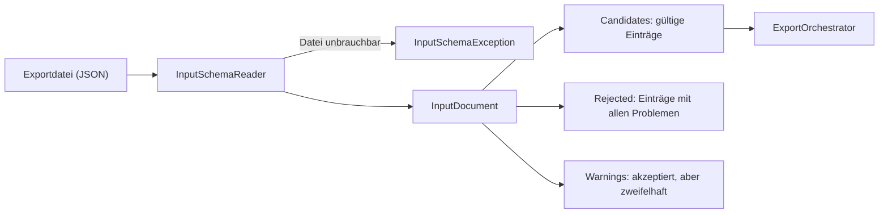

# Referenz der Eingabedatei

English version: [input-format.md](input-format.md)

Diese Seite beschreibt, wie BatInspectorPublisher die Exportdatei von [BatInspector](https://github.com/chrmue44/BatInspector)
liest und was sie von ihr erwartet: jedes Feld, wie Zeiten und Namen gedeutet werden, welche Einträge abgelehnt werden und
welche nur eine Warnung auslösen. Was eine Plattform mit den Einträgen macht, steht auf der Seite der jeweiligen Plattform,
für iNaturalist in [inaturalist.de.md](inaturalist.de.md).

Das Schema ist BatInspector-spezifisch. `SchemaVersion` ist Pflicht, und Änderungen innerhalb einer Version sind nur
additiv (ein neues optionales Feld macht eine alte Datei nie ungültig). Unbekannte Eigenschaften werden ignoriert.

## Von der Datei zu den Kandidaten



`InputSchemaReader.ReadFile(path)`, `Read(stream)` und `Parse(json)` tun dasselbe. Das JSON muss nicht aus einer Datei
kommen, aber die Belegpfade darin müssen auf Dateien auf dem Datenträger zeigen. Beim Lesen werden die Belegdateien nicht
angefasst; sie werden pro Kandidat gelesen und geprüft, wenn er veröffentlicht wird.

Die Prüfung erfolgt **pro Eintrag**. Ein fehlerhafter Eintrag fehlt in den Kandidaten und wird gemeldet, die übrigen
Einträge werden trotzdem zurückgegeben und können veröffentlicht werden. Nur eine Datei, die als Ganzes unbrauchbar ist,
löst eine Ausnahme aus (siehe [Dateiebene](#dateiebene)). Es gibt keinen Schalter für streng oder nachsichtig. Abgelehnte
Einträge werden nie veröffentlicht; nach dem Korrigieren der Datei kann der Lauf wiederholt werden: Bereits
veröffentlichte Einträge werden als Duplikate übersprungen.

## Beispiel

```json
{
  "SchemaVersion": 1,
  "DocumentFiles": [
    {
      "Date": "13.06.2026 04:26:34",
      "Latitude": 50.11,
      "Longitude": 8.682,
      "SpeciesLatin": "Pipistrellus nathusii",
      "SpeciesLocal": "Rauhautfledermaus",
      "Temperature": 20.5,
      "Humidity": 92.44,
      "Comment": null,
      "PathToPng": "C:\\data\\wav\\pnat_20260613_042634.png",
      "PathToWav": "C:\\data\\wav\\PNAT_20260613_042634.wav"
    }
  ]
}
```

## Eine Referenzaufnahme pro Art, Nacht und Ort

Die Datei soll eine **Referenzaufnahme** pro Art, Nacht und Ort enthalten, nicht jede Detektion. Es geht darum, eine Art
an einem Ort zu einer Zeit nachzuweisen, und dafür reicht meist eine gute Aufnahme. Die Duplikatprüfung der Plattform
verlässt sich darauf, mit Absicht: Ein zweiter Eintrag für dieselbe Kombination wird übersprungen. Die Auswahl der
Aufnahme muss der Export von BatInspector treffen; dieses Paket wählt nicht unter mehreren.

## Felder

Jedes Element von `DocumentFiles` ist ein Objekt mit diesen Eigenschaften. Texte werden getrimmt; ein leerer Text gilt als
fehlend, `null` ebenfalls.

| Feld | Pflicht | Typ | Bedeutung und Verwendung |
|---|---|---|---|
| `Date` | ja | Text `dd.MM.yyyy HH:mm:ss` | Wann die Aufnahme entstand, als Ortszeit ohne Offset. Wird in der Zone von `TimeZone` gelesen, siehe [Datum und Zeitzone](#datum-und-zeitzone). |
| `Latitude` | ja | Zahl, Grad | WGS84, -90 bis 90. Beide Koordinaten `0` wird abgelehnt (fehlende GPS-Position). |
| `Longitude` | ja | Zahl, Grad | WGS84, -180 bis 180. |
| `SpeciesLatin` | ja | Text | Wissenschaftlicher Name der Art oder Gattung oder einer der Gruppenwerte von BatInspector. Siehe [Artnamen](#artnamen). |
| `PathToPng` | ja | Text, absoluter Pfad | Spektrogramm des Referenzrufs. Muss auf `.png` enden. |
| `PathToWav` | ja | Text, absoluter Pfad | Audioaufnahme des Referenzrufs. Muss auf `.wav` enden. |
| `SpeciesLocal` | nein | Text | Lokaler (deutscher) Artname. Bleibt in `ObservationCandidate.LocalName`; keine Plattform nutzt ihn heute. |
| `Temperature` | nein | Zahl, °C | Lufttemperatur am Rekorder. Kommt in die Beschreibung der Beobachtung. |
| `Humidity` | nein | Zahl, % | Relative Luftfeuchte am Rekorder. Kommt in die Beschreibung der Beobachtung. |
| `Comment` | nein | Text | Anmerkung der Person, die die Bestimmung geprüft hat. Kommt in die Beschreibung der Beobachtung. |
| `TimeZone` | nein | Text, IANA-Id | Die Zone, in der `Date` gelesen wird, zum Beispiel `Europe/Lisbon`. Standard `Europe/Berlin`. |

### Datum und Zeitzone

`Date` enthält keinen Offset. Es wird als **deutsche Ortszeit (Europe/Berlin)** gelesen, einschließlich Sommerzeit, es sei
denn, der Eintrag nennt in `TimeZone` eine andere Zone (eine IANA-Id; eine unbekannte Id lässt den Eintrag ablehnen). Das
Ergebnis wird mit dem Offset gespeichert, den diese Zone an diesem Datum hat (`ObservationCandidate.ObservedAt` ist ein
`DateTimeOffset`). Es wird nie aus der Zeitzone des Hosts oder des Rechners umgerechnet.

| Situation | Ergebnis |
|---|---|
| Uhrzeit, die es nicht gibt (die beim Vorstellen der Uhr übersprungene Stunde) | Eintrag abgelehnt |
| Uhrzeit in der beim Zurückstellen doppelten Stunde | Als Normalzeit gelesen, Warnung, Eintrag veröffentlicht |
| Offset im Wert (`Z`, `+02:00`) | Eintrag als Formatfehler abgelehnt. Die Zone stattdessen mit `TimeZone` angeben. |
| `Date` in der Zukunft (als Zeitpunkte verglichen) | Eintrag abgelehnt |

Der Kalendertag, den die Duplikatprüfung und die Plattformen verwenden, ist der lokale Tag dieser Zone. Der Host braucht die
Zeitzonendaten für Europe/Berlin; ohne sie wirft der Reader eine `TimeZoneNotFoundException`, statt zu raten. Wie eine
Plattform die Uhrzeit behandelt, steht auf ihrer Seite (iNaturalist erhält derzeit nur das Kalenderdatum).

### Artnamen

`SpeciesLatin` wird normalisiert: Das erste Wort wird groß-, alle weiteren kleingeschrieben, Leerraum wird zusammengezogen
(`Eptesicus Serotinus` wird zu `Eptesicus serotinus`). Das ist die einzige Änderung, die das Paket an einem Namen vornimmt.

- Ein Name aus zwei Wörtern ist eine Art, ein Name aus einem Wort eine Gattung (`Myotis`). Namen aus drei oder mehr Wörtern (`Myotis cf. daubentonii`) sind kein
  Taxon, unter dem das Paket eine Beobachtung ablegt: Sie lösen hier eine Warnung aus und werden von der Plattform übersprungen.
- Ob ein Name existiert, entscheidet die Plattform live für jeden Kandidaten; das Paket liefert keine Artenliste und keinen
  Cache mit, weil sich die Taxonomie ändert (Namen werden geteilt, zusammengelegt und umbenannt). Ein Name, der nichts
  findet, nur ein Synonym ist, den falschen Rang hat oder mehrdeutig ist, wird mit dem Grund übersprungen und nie geraten.
  Ein Synonym wird mit dem aktuellen Namen gemeldet; korrigiert wird die Eingabedatei, nicht das Paket.
- Die Gruppen- und Unsicherheitswerte von BatInspector sind die einzige Ausnahme: Eine kleine feste Tabelle ordnet sie
  einem weiteren Taxon zu. Welche Werte das sind und wie sie abgelegt werden, steht auf der Plattformseite
  ([inaturalist.de.md](inaturalist.de.md#art-und-taxon)).
- Andere Werte, die kein Taxonname sind (`todo`, ein unbekanntes BatInspector-Kürzel, ein Tippfehler), werden übersprungen,
  damit ein korrigierter erneuter Lauf keine zweite Beobachtung anlegt.

### Belegdateien

Ohne beide Dateien wird nichts veröffentlicht.

- Pfade müssen absolut sein, in Windows- (`C:\...`, `\\server\share\...`) oder Unix-Schreibweise (`/...`), auf jedem
  Betriebssystem, und werden nie gegen das Arbeitsverzeichnis aufgelöst. Die Datei muss existieren, wenn der Eintrag
  veröffentlicht wird, nicht beim Lesen.
- Jede Datei wird pro Kandidat **einmal** gelesen und geprüft: nicht leer; das Spektrogramm beginnt mit der PNG-Signatur,
  die Audiodatei ist ein RIFF-Container vom Typ WAVE. Hochgeladen werden genau die geprüften Bytes, was geprüft wurde, wird also gesendet.
- Das ist eine Prüfung der ersten Bytes, keine vollständige Formatprüfung. Eine Datei kann wie ein PNG beginnen und trotzdem
  etwas anderes sein. Grenzen der Plattform (Größe, akzeptierte Formate) prüft der Adapter, bevor etwas geschrieben wird.

## Prüfung

Es gibt drei Ebenen, von der ganzen Datei bis zum Moment des Veröffentlichens.

### Dateiebene

Diese Probleme machen die ganze Datei unbrauchbar. Der Reader wirft `InputSchemaException` (`Issues` listet sie mit ihrem Pfad):

- kein wohlgeformtes JSON, oder die Wurzel ist kein Objekt;
- `SchemaVersion` fehlt, ist keine positive ganze Zahl oder neuer als `InputSchemaReader.CurrentSchemaVersion` (Paket aktualisieren);
- `DocumentFiles` fehlt oder ist kein Array.

### Eintragsebene: abgelehnt

Der Eintrag fehlt in `InputDocument.Candidates` und steht mit **allen** gefundenen Problemen in `InputDocument.Rejected`,
jeweils mit JSON-Pfad (`DocumentFiles[2].Latitude`). Veröffentlichen ist öffentlich und nicht rückgängig zu machen; alles
Zweifelhafte, das sich danach nicht mehr korrigieren lässt, ist deshalb ein Fehler und keine Warnung.

| Problem | Pfad |
|---|---|
| Der Eintrag ist kein Objekt | `DocumentFiles[i]` |
| Ein Pflichtfeld fehlt | das Feld |
| Ein Wert hat den falschen Typ (Text statt Zahl, ...) | das Feld |
| `Date` passt nicht zu `dd.MM.yyyy HH:mm:ss`, ist eine Uhrzeit, die es nicht gibt, oder liegt in der Zukunft | `Date` |
| `TimeZone` ist keine bekannte IANA-Id | `TimeZone` |
| `Latitude` außerhalb von -90 bis 90, `Longitude` außerhalb von -180 bis 180 | das Feld |
| `Latitude` und `Longitude` beide `0` | `Latitude` |
| `PathToPng` / `PathToWav` ist nicht absolut oder endet nicht auf `.png` / `.wav` | das Feld |

Ein Kandidat, der im Code statt aus einer Datei gebaut wurde, wird beim Veröffentlichen von denselben Wertprüfungen beurteilt
(`PublishStatus.SkippedInvalidEntry`).

### Eintragsebene: Warnungen

Der Eintrag wird akzeptiert und veröffentlicht, aber etwas ist zweifelhaft. Die Warnungen stehen in `InputDocument.Warnings`
zusammen mit dem Index des Eintrags. **Sie sollten dem Nutzer vor einem echten Lauf angezeigt werden.** Ein Lauf, der nur die
Kandidaten bekommt, meldet sie nie; der `RunReport` von `ExportOrchestrator.RunAsync(InputDocument, ...)` schon.

| Warnung | Was mit dem Eintrag geschieht |
|---|---|
| `Date` in der beim Zurückstellen doppelten Stunde | Als Normalzeit gelesen. Uhrzeit prüfen. |
| `Temperature` außerhalb von -40 bis 60 °C | Der Wert wird weggelassen (Sensor-Fehlercodes wie -127 oder 85 landen hier). |
| `Humidity` außerhalb von 0 bis 100 % | Der Wert wird weggelassen. |
| `Date` zwischen 09:00 und 15:59 Ortszeit | Wird unverändert veröffentlicht. Fledermäuse fliegen nachts: Geräteuhr und `TimeZone` prüfen. |
| `SpeciesLatin` aus drei oder mehr Wörtern | Vom Reader akzeptiert. Es wird keinem Taxon zugeordnet, die Plattform überspringt es beim Veröffentlichen. |
| Dieselbe Art, Zeit und Position wie ein früherer Eintrag der Datei | Beide werden veröffentlicht, sofern die Duplikatprüfung der Plattform es nicht abfängt. |

### Beim Veröffentlichen: übersprungen

Alles oben geschieht beim Lesen der Datei. Was die Plattform später entscheidet, wird pro Kandidat als `PublishResult` mit
einem `PublishStatus` gemeldet, den Grund nennt `Message`: fehlende oder ungültige Belege, eine unbekannte Art, eine Regel
der Plattform, ein Duplikat. Die Status und ihre Bedeutung bei iNaturalist: [inaturalist.de.md](inaturalist.de.md#ergebnisse).

## Was der Host anzeigt

```csharp
var input = InputSchemaReader.ReadFile(path);

foreach (var rejected in input.Rejected)
    foreach (var issue in rejected.Issues)
        Console.WriteLine($"Eintrag {rejected.Index} abgelehnt: {issue}");   // "DocumentFiles[2].Latitude: ..."

foreach (var warning in input.Warnings)
    Console.WriteLine($"Eintrag {warning.Index}: {warning.Issue}");
```

`RejectedEntry.Index` und `EntryWarning.Index` sind nullbasierte Positionen in `DocumentFiles`; `ObservationCandidate.EntryIndex`
ordnet einen Kandidaten (und damit ein Ergebnis) seinem Eintrag zu.

## BatInspector als Quelle

BatInspector ist Open Source; sein Code ist die Referenz dafür, was ein Feld oder Wert bedeutet (zum Beispiel die Artenliste
in `BatInfo.cs`). Der Export und seine neuesten Werte können auf einem anderen Branch als `main` liegen oder noch nicht
veröffentlicht sein, der öffentliche Code kann also hinter dem zurückliegen, was BatInspector tatsächlich schreibt. Zwei
Namen seiner Artenliste lösen bei iNaturalist heute nicht auf; das gehört in den Export von BatInspector, nicht hierher
(die Liste: [batinspector-taxa-check.de.md](batinspector-taxa-check.de.md)).
