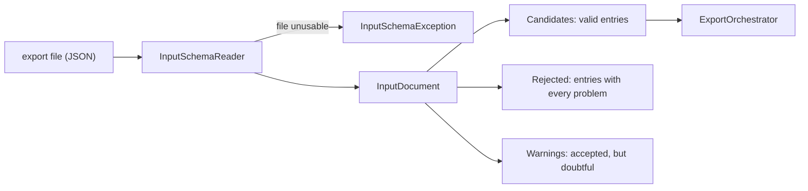

# Input file reference

German version: [input-format.de.md](input-format.de.md)

This page describes how BatInspectorPublisher reads the export file of [BatInspector](https://github.com/chrmue44/BatInspector)
and what it expects of it: every field, how times and names are interpreted, which entries are rejected and which only
draw a warning. What a platform does with the entries is described per platform, for iNaturalist in
[inaturalist.md](inaturalist.md).

The schema is BatInspector-specific. `SchemaVersion` is required, and changes within a version are additive only (a new
optional field never breaks an old file). Unknown properties are ignored.

## From file to candidates



`InputSchemaReader.ReadFile(path)`, `Read(stream)` and `Parse(json)` do the same. The JSON does not have to come from a
file, but the evidence paths inside it must point to files on disk. Reading does not touch the evidence files; they are read
and checked per candidate when it is published.

Validation is **per entry**. A bad entry is left out and reported, the other entries are still returned and can be
published. Only a file that is structurally unusable throws (see [File level](#file-level)). There is no strict or lenient
switch. Rejected entries are never published; after fixing the file, run it again: entries that are already published are
skipped as duplicates.

## Example

```json
{
  "SchemaVersion": 1,
  "DocumentFiles": [
    {
      "Date": "13.06.2026 04:26:34",
      "Latitude": 50.11,
      "Longitude": 8.682,
      "SpeciesLatin": "Pipistrellus nathusii",
      "SpeciesLocal": "Rauhautfledermaus",
      "Temperature": 20.5,
      "Humidity": 92.44,
      "Comment": null,
      "PathToPng": "C:\\data\\wav\\pnat_20260613_042634.png",
      "PathToWav": "C:\\data\\wav\\PNAT_20260613_042634.wav"
    }
  ]
}
```

## One reference recording per species, night and place

The file is expected to hold **one reference recording** (*Referenzaufnahme*) per species, night and place, not every
detection. The goal is to document that a species was present at a place and time, and one good recording is usually
enough. The duplicate check of the platform relies on this on purpose: a second entry for the same combination is skipped.
BatInspector's export has to select the recording; this package does not choose among several.

## Fields

Each element of `DocumentFiles` is an object with these properties. Text values are trimmed; an empty text counts as
missing. `null` counts as missing too.

| Field | Required | Type | Meaning and how it is used |
|---|---|---|---|
| `Date` | yes | text `dd.MM.yyyy HH:mm:ss` | When the recording was made, as local time without an offset. Read in the zone of `TimeZone`, see [Date and time zone](#date-and-time-zone). |
| `Latitude` | yes | number, degrees | WGS84, -90 to 90. Both coordinates `0` is rejected (missing GPS fix). |
| `Longitude` | yes | number, degrees | WGS84, -180 to 180. |
| `SpeciesLatin` | yes | text | Scientific name of the species or genus, or one of BatInspector's group values. See [Species names](#species-names). |
| `PathToPng` | yes | text, absolute path | Spectrogram image of the reference call. Must end in `.png`. |
| `PathToWav` | yes | text, absolute path | Audio recording of the reference call. Must end in `.wav`. |
| `SpeciesLocal` | no | text | Local (German) species name. Kept in `ObservationCandidate.LocalName`; no platform uses it today. |
| `Temperature` | no | number, °C | Air temperature at the recorder. Goes into the observation description. |
| `Humidity` | no | number, % | Relative humidity at the recorder. Goes into the observation description. |
| `Comment` | no | text | Remark of the person who verified the identification. Goes into the observation description. |
| `TimeZone` | no | text, IANA id | The zone `Date` is read in, for example `Europe/Lisbon`. Default `Europe/Berlin`. |

### Date and time zone

`Date` carries no offset. It is read as **German local time (Europe/Berlin)**, daylight saving time included, unless the
entry names another zone in `TimeZone` (an IANA id; an unknown id rejects the entry). The result is stored with the offset
that zone has on that date (`ObservationCandidate.ObservedAt` is a `DateTimeOffset`). The time is never converted from the
time zone of the host or the machine.

| Situation | Result |
|---|---|
| Time that does not exist (the hour skipped when the clocks go forward) | Entry rejected |
| Time in the repeated hour when the clocks go back | Read as standard time, warning, entry published |
| Offset in the value (`Z`, `+02:00`) | Entry rejected as a format error. Name the zone with `TimeZone` instead. |
| `Date` in the future (compared as instants) | Entry rejected |

The calendar day that the duplicate check and the platforms use is the local day of that zone. The host needs the time
zone data for Europe/Berlin; without it the reader throws `TimeZoneNotFoundException` instead of guessing. How a platform
treats the time is described on its page (iNaturalist currently receives only the calendar date).

### Species names

`SpeciesLatin` is normalized: the first word gets a capital letter, all others are lower case, and whitespace is collapsed
(`Eptesicus Serotinus` becomes `Eptesicus serotinus`). That is the only change the package makes to a name.

- A name of two words is a species, a name of one word is a genus (`Myotis`). Names of three or more words (`Myotis cf. daubentonii`) are no taxon the package
  files an observation under: they draw a warning here and are skipped by the platform.
- Whether a name exists is decided live by the platform for every candidate; the package ships no species list and no
  cache, because the taxonomy changes (names are split, merged and renamed). A name that matches nothing, is only a
  synonym, has the wrong rank or is ambiguous is skipped with the reason, never guessed. A synonym is reported with its
  current name, and the input file is corrected, not the package.
- BatInspector's group and uncertain values are the one exception: a small fixed table maps them to a broader taxon.
  Which values and how they are filed is part of the platform page ([inaturalist.md](inaturalist.md#species-and-taxon)).
- Other values that are no taxon name (`todo`, an unknown BatInspector code, a typo) are skipped, so a corrected re-run does
  not create a second observation.

### Evidence files

Nothing is published without both files.

- Paths must be absolute, in Windows (`C:\...`, `\\server\share\...`) or Unix (`/...`) syntax, on every operating system, and
  are never resolved against the working directory. The file must exist when the entry is published, not when it is read.
- Each file is read **once** per candidate and checked: not empty; the spectrogram starts with the PNG signature, the audio
  is a RIFF container of type WAVE. The checked bytes are what gets uploaded, so what was validated is what is sent.
- This is a check of the first bytes, not a full format validation. A file can start like a PNG and still be something
  else. Platform limits (size, accepted formats) are checked by the adapter before anything is written.

## Validation

There are three levels, from the whole file down to the moment of publishing.

### File level

These problems make the whole file unusable. The reader throws `InputSchemaException` (`Issues` lists them with their path):

- not well-formed JSON, or the root is not an object;
- `SchemaVersion` missing, not a positive integer, or newer than `InputSchemaReader.CurrentSchemaVersion` (update the package);
- `DocumentFiles` missing or not an array.

### Entry level: rejected

The entry is left out of `InputDocument.Candidates` and listed in `InputDocument.Rejected` with **every** problem found,
each with its JSON path (`DocumentFiles[2].Latitude`). Publishing is public and irreversible, so anything doubtful that
cannot be fixed afterwards is an error, not a warning.

| Problem | Path |
|---|---|
| The entry is not an object | `DocumentFiles[i]` |
| A required field is missing | the field |
| A value has the wrong type (text where a number is expected, ...) | the field |
| `Date` does not match `dd.MM.yyyy HH:mm:ss`, is a time that does not exist, or lies in the future | `Date` |
| `TimeZone` is not a known IANA id | `TimeZone` |
| `Latitude` outside -90 to 90, `Longitude` outside -180 to 180 | the field |
| `Latitude` and `Longitude` both `0` | `Latitude` |
| `PathToPng` / `PathToWav` is not absolute, or does not end in `.png` / `.wav` | the field |

A candidate built in code instead of read from a file is judged by the same value checks when it is published
(`PublishStatus.SkippedInvalidEntry`).

### Entry level: warnings

The entry is accepted and published, but something is doubtful. The warnings are in `InputDocument.Warnings`, next to the
index of the entry. **Show them to the user before a real run.** A run over the candidates alone never reports them; the
`RunReport` of `ExportOrchestrator.RunAsync(InputDocument, ...)` does.

| Warning | What happens to the entry |
|---|---|
| `Date` in the repeated hour when the clocks go back | Read as standard time. Check the time. |
| `Temperature` outside -40 to 60 °C | The value is left out (sensor error codes such as -127 or 85 land here). |
| `Humidity` outside 0 to 100 % | The value is left out. |
| `Date` between 09:00 and 15:59 local time | Published as it is. Bats fly at night: check the device clock and `TimeZone`. |
| `SpeciesLatin` of three or more words | Accepted by the reader. It will not resolve to a taxon, so the platform skips it at publish time. |
| Same species, time and position as an earlier entry of the file | Both are published unless the platform's duplicate check catches it. |

### At publish time: skipped

Everything above happens when the file is read. What the platform decides later is reported per candidate as a
`PublishResult` with a `PublishStatus`, and the reason in `Message`: missing or invalid evidence, an unknown species, a
rule of the platform, a duplicate. The statuses and what they mean on iNaturalist: [inaturalist.md](inaturalist.md#results).

## What the host shows

```csharp
var input = InputSchemaReader.ReadFile(path);

foreach (var rejected in input.Rejected)
    foreach (var issue in rejected.Issues)
        Console.WriteLine($"Rejected entry {rejected.Index}: {issue}");   // "DocumentFiles[2].Latitude: ..."

foreach (var warning in input.Warnings)
    Console.WriteLine($"Entry {warning.Index}: {warning.Issue}");
```

`RejectedEntry.Index` and `EntryWarning.Index` are zero-based positions in `DocumentFiles`; `ObservationCandidate.EntryIndex`
maps a candidate (and so a result) back to its entry.

## BatInspector as the source

BatInspector is open source; its code is the reference for what a field or value means (for example the species list in
`BatInfo.cs`). The export and its newest values may live on another branch than `main` or not be pushed yet, so the public
code can lag behind what BatInspector actually writes. Two things in its species list do not resolve on iNaturalist today;
that belongs into BatInspector's export, not here (the list, in German: [batinspector-taxa-check.de.md](batinspector-taxa-check.de.md)).
